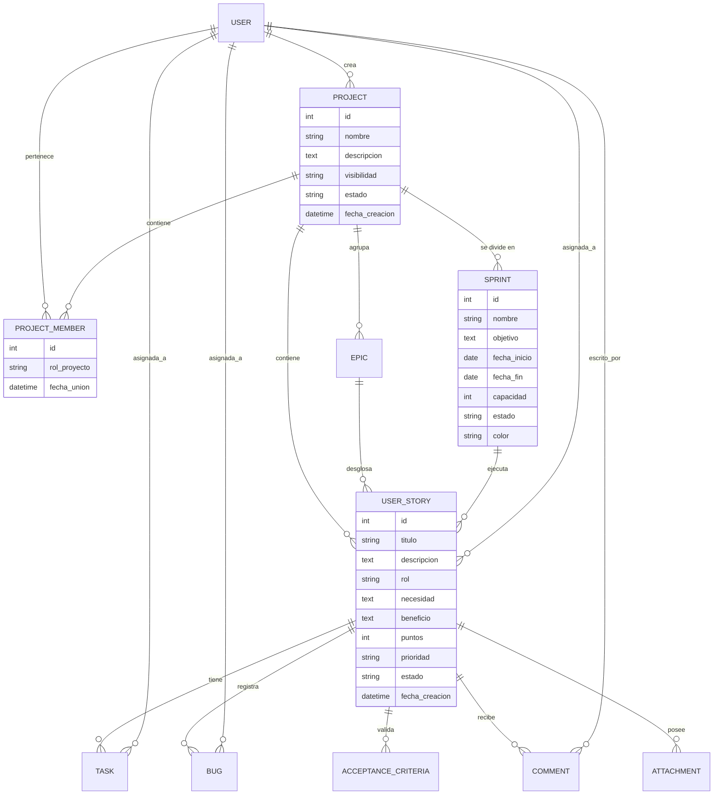

# Resumen del Proyecto: DevGestión

DevGestión es una plataforma avanzada de gestión de proyectos ágiles (Scrum) que permite a los equipos de desarrollo organizar, planificar y ejecutar sus flujos de trabajo de manera eficiente. El sistema está diseñado para ser intuitivo, visualmente atractivo y funcionalmente robusto.

## 🚀 Funcionalidades Clave

### 1. Gestión de Proyectos y Miembros
- **Creación de Proyectos**: Permite definir proyectos con diferentes niveles de visibilidad (Público/Privado).
- **Colaboración**: Sistema de invitaciones y roles (Dueño/Colaborador) para gestionar el acceso del equipo.
- **Perfiles Públicos**: Visualización del trabajo y contribuciones de los usuarios.

### 2. Backlog y Planificación
- **Gestión de Historias de Usuario**: Creación, edición y priorización de HUs utilizando el formato Scrum (Rol, Necesidad, Beneficio).
- **Épicas**: Agrupación de alto nivel para organizar el trabajo a gran escala.
- **Workspace de Planificación**: Una interfaz de arrastrar y soltar (Drag & Drop) para asignar historias del backlog a los sprints de manera estratégica.
- **Cálculo de Capacidad**: Monitoreo en tiempo real de los puntos de historia asignados vs. la capacidad del sprint.

### 3. Ejecución Scrum
- **Tablero Kanban**: Visualización clara del estado de las tareas (Pendiente, En Progreso, En Pruebas, Terminado).
- **Gestión de Sprints**: Ciclos de trabajo iterativos con fechas de inicio y fin, objetivos claros y seguimiento de estado.
- **Tareas y Bugs**: Desglose detallado del trabajo dentro de cada historia de usuario.

### 4. Análisis y Reportes
- **Métricas Ágiles**: Cálculo automático de progreso, velocidad y completitud.
- **Reporte Ejecutivo**: Generación y descarga de reportes detallados en formato PDF para presentaciones a stakeholders.

---

## 🛠️ Especificaciones Técnicas

### Stack Tecnológico
DevGestión utiliza un stack moderno de alto rendimiento para garantizar una experiencia de usuario fluida y una base de código mantenible.

- **Frontend**:
    - **Framework**: [React](https://reactjs.org/) con [Vite](https://vitejs.dev/) para un desarrollo ultrarrápido.
    - **Lenguaje**: [TypeScript](https://www.typescriptlang.org/) para garantizar la robustez y seguridad de tipos.
    - **Estilizado**: [Vanilla CSS](https://developer.mozilla.org/es/docs/Web/CSS) y [Tailwind CSS](https://tailwindcss.com/) para un diseño premium y responsive.
    - **Iconografía**: [Lucide React](https://lucide.dev/).
    - **Drag & Drop**: [@hello-pangea/dnd](https://github.com/hello-pangea/dnd) para la planificación interactiva.
    - **Gestión de API**: [Axios](https://axios-http.com/) con interceptores para manejo global de autenticación y errores.

- **Backend**:
    - **Framework**: [Django](https://www.djangoproject.com/) con [Django REST Framework (DRF)](https://www.django-rest-framework.org/).
    - **Autenticación**: [SimpleJWT](https://django-rest-framework-simplejwt.readthedocs.io/) para manejo de tokens de acceso y refresco.
    - **Procesamiento de PDF**: Generación dinámica de reportes ejecutivos.

### Arquitectura del Sistema
El proyecto sigue una arquitectura de **Desacoplamiento Front-Back** mediante una API RESTful.

1.  **Capa de Presentación (Frontend)**: Organizada por componentes reutilizables, servicios de API dedicados y páginas de alto nivel. Implementa lógica de rutas protegidas y manejo de estado local.
2.  **Capa de Aplicación (API REST)**: Los ViewSets de Django gestionan la lógica de negocio, validaciones y permisos.
3.  **Capa de Datos**: Modelos de Django que definen la estructura relacional de la metodología Scrum.

---

## 📊 Arquitectura de Base de Datos

La base de datos está diseñada para soportar relaciones complejas necesarias en una metodología Scrum, asegurando la integridad referencial y el rendimiento.

### Diagrama Entidad-Relación (Mermaid)

### Modelos Principales
- **Proyecto**: Almacena los metadatos del proyecto y su estado global.
- **Sprint**: Define los periodos de iteración con metas y capacidad de puntos específica.
- **Historia de Usuario**: El núcleo del trabajo, incluyendo campos específicos de Scrum y estimaciones.
- **Miembros e Invitaciones**: Gestión granular de permisos y colaboración en equipo.
- **Tareas, Bugs y Criterios**: El nivel más bajo de detalle para la ejecución y validación del trabajo.
- **Ceremonias**: Registro de Dailies, Planning, Reviews y Retrospectivas.

---
*DevGestión: Potenciando la agilidad en el desarrollo de software mediante tecnología de vanguardia.*
